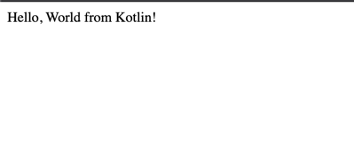

# DeploymentTester-Kotlin

Will help you try any new deployment flow. This repo contains a simple Kotlin API that is meant to provide health status after deployment.

## Why is this useful?

Let's say you are looking for new options to deploy your app and you want to try the integration with github and how it works. Instead of boilerplating a whole repo or having to set all the secrets required for a big app, you can use this simple app to give it a try. As simple as that.

## What to expect?

Depending on the provider you are using to deploy, you can have different behaviors in terms of UI and deployment flow but once the deployment is done, you should be able to access and see this on your web browser:

## Where can I deploy this?

Anywhere that can support docker deployments based on a dockerfile. This has been tested with the free tier of [render.com](https://render.com/)